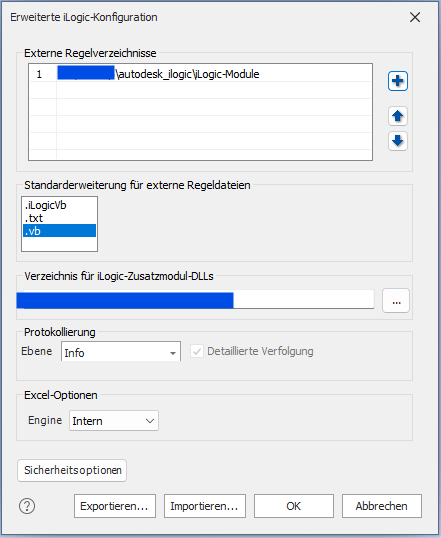

# Autodesk Inventor iLogic Modules

Ein paar kleine Code-Schnipsel für Autodesk Inventor iLogic.

## Installation

Entweder man kopiert die Inhalte der Dateien in jeweils eine eigene Regel, um diese dann in den Dokumenten dann aufrufen zu können.

**oder**

Die iLogic-Konfiguration unter Extras öffen

In diesem Optionsdialog das Verzeichnis, in dem sich diese einzelnen Module gefinden, als externes Regel-Verzeichnis anlegen

Zusätzlich sollte die Standard-Erweiterung der RegelDateien von **.iLogicVB** auf **.vb** geändert werden. Diese Änderung veranlasst die iLogic-Engine dazu, den erweiterten .NET-Befehlssatz für diese Dateien zu verwenden. Ohne diese Einstellungen können die Spalten in der Parameter-Tabelle nicht automatisch angelegt werden.